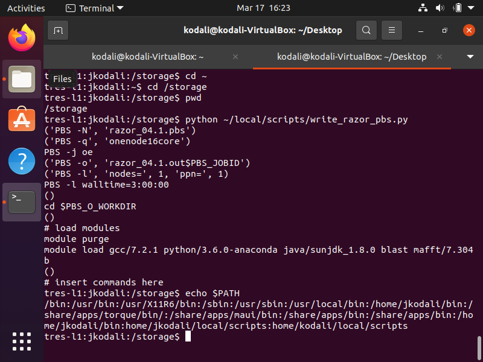

# BIOL5153
### assn03
* Using BLAST to search the watermelon nad4L nucleotide sequence to different databases

### assn04
* Screenshot of pwd and python script
* Added Python Scripts: PBS and SLURM

